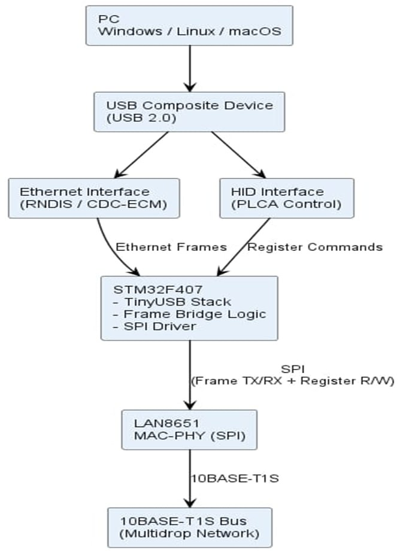
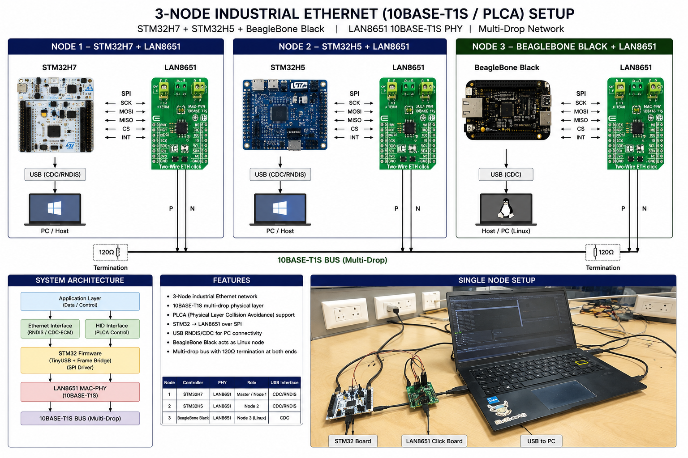
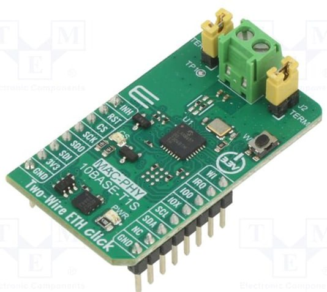
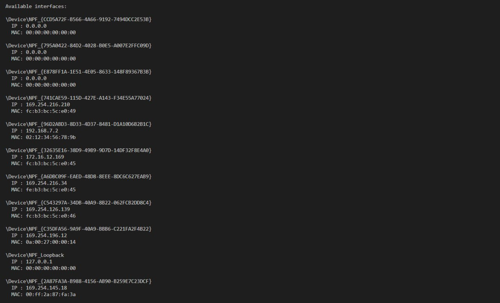
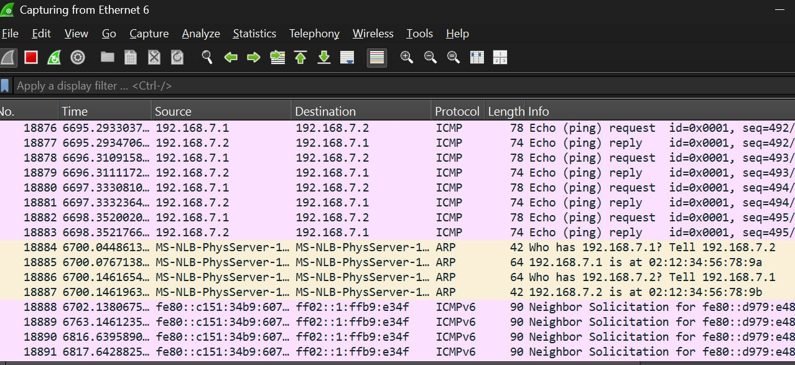
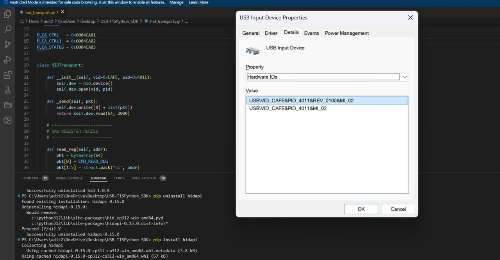
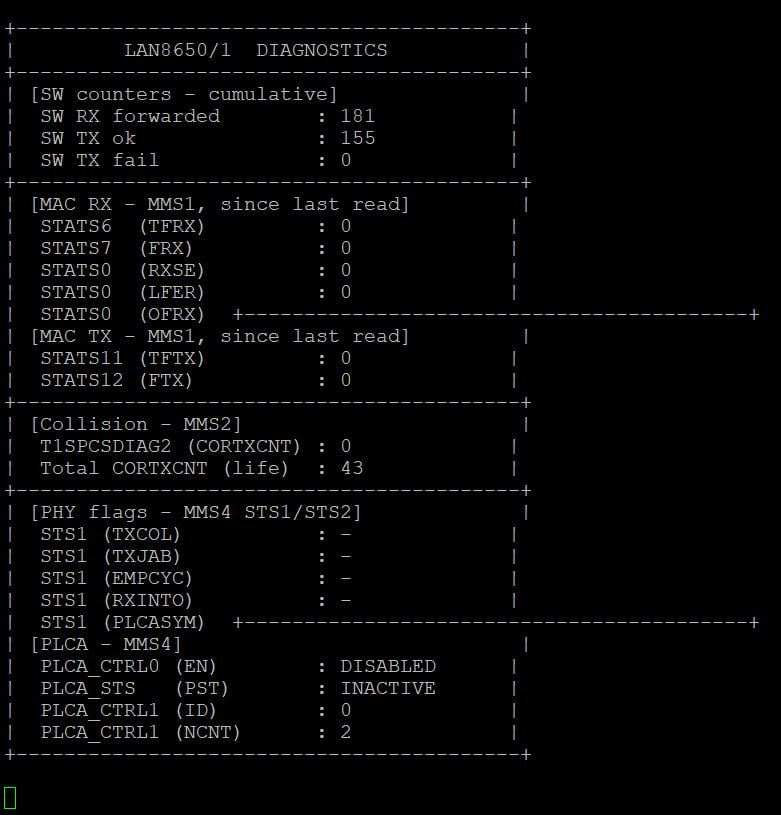

# LAN8651 Industrial Ethernet Stack

## Overview

This repository contains the development of an industrial Ethernet communication system using STM32 microcontrollers and the LAN8651 10BASE-T1S MAC-PHY.

The project focuses on:
- SPI-based Ethernet communication
- USB RNDIS / CDC-NCM integration
- USB HID-based PLCA control
- Multi-node 10BASE-T1S networking
- Register-level LAN8651 configuration
- Ethernet frame analysis
- Wireshark packet diagnostics
- STM32 ↔ BeagleBone communication

The system was developed and tested using:
- STM32H7
- STM32H5
- STM32F407
- BeagleBone Black
- LAN8651 MAC-PHY

---

# Project Goals

This project was developed to explore:
- Industrial Ethernet communication
- 10BASE-T1S multi-drop networking
- PLCA (Physical Layer Collision Avoidance)
- USB networking on STM32
- Embedded communication stack development
- Ethernet packet handling and diagnostics
- Embedded Linux + MCU communication

---

# System Architecture



The firmware architecture consists of:
- USB composite device support using TinyUSB
- USB RNDIS / CDC-NCM Ethernet interface
- USB HID interface for PLCA control
- SPI-based communication with LAN8651
- Ethernet frame bridge logic
- Register-level MAC-PHY configuration
- 10BASE-T1S multi-drop network communication

The STM32 firmware acts as a bridge between:
- USB networking interfaces
- HID control interface
- LAN8651 industrial Ethernet PHY
- Multi-node 10BASE-T1S network

---

# 3-Node Industrial Ethernet Setup

## Multi-Node Communication Architecture



This setup demonstrates:
- STM32H7 ↔ LAN8651 communication
- STM32H5 ↔ LAN8651 communication
- BeagleBone ↔ LAN8651 communication
- Multi-node 10BASE-T1S bus communication
- PLCA-enabled collision-free networking
- USB-to-Ethernet bridging

---

# Single Node Development Setup

## Real Hardware Setup



Development and debugging setup used during firmware integration and Ethernet communication testing.

The setup includes:
- STM32 development board
- LAN8651 Click board
- USB communication to PC
- SPI-based MAC-PHY communication
- Ethernet frame testing

---

# Ethernet Frame Communication

## Ethernet Packet Transfer



This image shows Ethernet frame transfer testing between nodes over the 10BASE-T1S network.

Features tested:
- Packet transmission
- Packet reception
- Frame integrity
- Multi-node communication
- Ethernet frame routing

---

# Wireshark Packet Analysis

## Ethernet Diagnostics and Debugging



Wireshark was used for:
- Ethernet packet inspection
- Communication debugging
- Packet validation
- Throughput analysis
- Frame diagnostics

Parameters analyzed:
- Ethernet frame structure
- Packet timing
- Transfer stability
- Communication reliability

---

# USB Composite Device

## RNDIS + CDC-NCM + HID Integration



The STM32 firmware implements a USB composite device supporting:
- USB CDC-NCM
- USB RNDIS
- USB HID interface

### USB Features

#### USB Networking
- Ethernet-over-USB
- Virtual network adapter
- Packet bridging

#### USB HID
- PLCA configuration commands
- Register control
- Diagnostic communication

---

# Diagnostics and Monitoring

## Communication Diagnostics



Diagnostic utilities were implemented for:
- Register monitoring
- Packet statistics
- Communication debugging
- Throughput monitoring
- Error analysis

---

# Hardware Used

## Microcontrollers
- STM32H7
- STM32H5
- STM32F407

## Linux Node
- BeagleBone Black

## Ethernet PHY
- LAN8651 10BASE-T1S MAC-PHY

## Interfaces
- SPI
- USB
- Ethernet
- GPIO

---

# Firmware Features

## Communication Stack
- SPI communication driver
- Ethernet frame bridge
- USB networking
- USB HID interface
- Multi-node packet handling

## Industrial Ethernet Features
- 10BASE-T1S communication
- PLCA support
- Multi-drop networking
- Ethernet packet routing

## Firmware Architecture
- Modular driver structure
- Register-level PHY configuration
- TinyUSB integration
- Communication abstraction layer

---

# Software Stack

## Embedded
- STM32 HAL
- CMSIS
- TinyUSB

## Debugging and Analysis
- Wireshark
- Logic Analyzer
- Python diagnostic tools

---

# Folder Structure

```text
lan8651-industrial-ethernet-stack/
│
├── App/
│   ├── Communication/
│   ├── LAN8651/
│   ├── PLCA/
│   ├── USB/
│   └── Diagnostics/
│
├── Core/
│   ├── Inc/
│   ├── Src/
│   └── Startup/
│
├── Drivers/
│   ├── CMSIS/
│   ├── BSP/
│   └── STM32H5xx_HAL_Driver/
│
├── Middleware/
│   └── TinyUSB/
│
├── Images/
│
├── README.md
├── .gitignore
└── project.ioc
```

---

# SPI Communication Flow

```text
STM32 Firmware
      ↓
SPI Driver
      ↓
LAN8651 Register Access
      ↓
Ethernet Frame TX/RX
      ↓
10BASE-T1S Bus
```

---

# PLCA Support

The project includes:
- PLCA node configuration
- Register-level PLCA control
- Multi-node collision avoidance
- Timing synchronization analysis

PLCA configuration was implemented using:
- SPI register access
- USB HID control interface
- Diagnostic monitoring tools

---

# Engineering Challenges

## SPI Synchronization
- Frame timing stability
- Register access synchronization
- Communication reliability

## USB Enumeration
- Composite device configuration
- USB descriptor handling
- Host compatibility

## Multi-Node Communication
- PLCA timing
- Packet synchronization
- Collision handling

## Ethernet Diagnostics
- Packet validation
- Wireshark debugging
- Throughput monitoring

---

# Performance Analysis

The following were analyzed:
- Ethernet throughput
- Packet transfer latency
- USB communication stability
- SPI transfer timing
- Multi-node reliability

---

# Future Improvements

Planned improvements:
- FreeRTOS integration
- DMA optimization
- Advanced packet diagnostics
- Web dashboard
- Real-time monitoring tools
- Automated throughput benchmarking

---

# Third-Party Components

This project uses:
- STM32 HAL
- CMSIS
- TinyUSB

All third-party components remain property of their respective maintainers.

---

# Repository Purpose

This repository demonstrates:
- Embedded firmware engineering
- Industrial Ethernet communication
- Embedded networking systems
- USB networking integration
- Protocol stack development
- Ethernet diagnostics
- Real-time communication systems

---

# Author

Embedded firmware and industrial communication development project focused on STM32-based industrial networking systems.